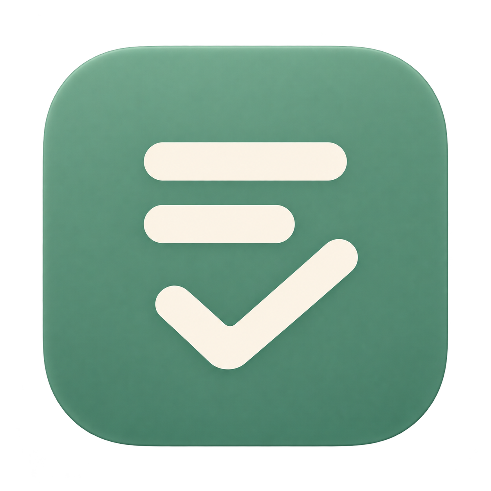
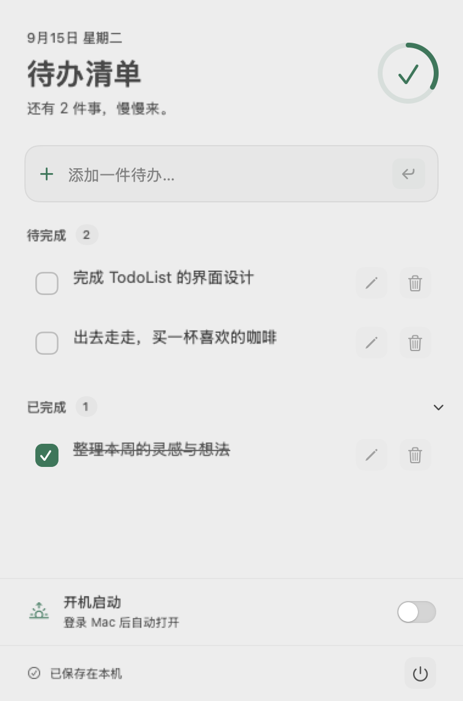
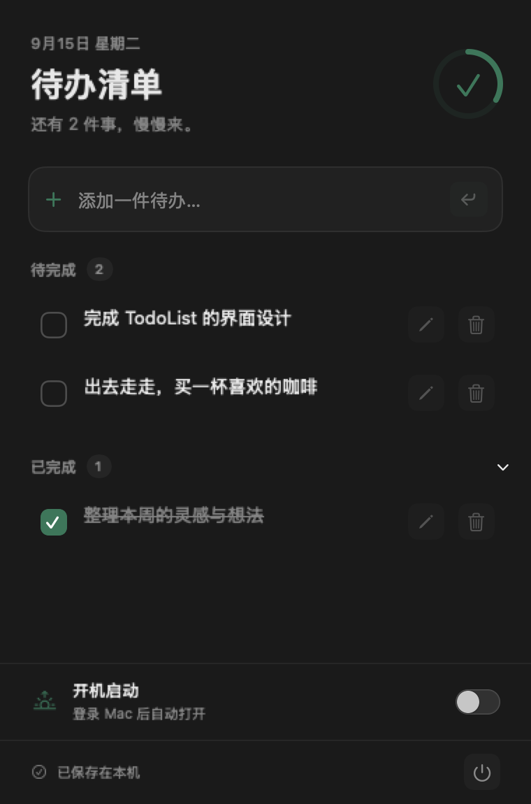

<p align="center"></p>

# TodoList

原生 macOS 菜单栏待办工具。中文界面，支持添加、编辑、删除、完成与恢复，任务自动保存在本机。

## 界面预览

<p>
  
  
</p>

预览使用示例任务。

## 下载

从 [Releases](https://github.com/KamiOrz/todolist/releases/latest) 下载 macOS 通用版 ZIP（Apple Silicon / Intel）。解压后将 TodoList.app 拖入“应用程序”，双击启动，然后点击顶部菜单栏的清单图标。需要 macOS 14 或更高版本。

当前安装包为临时签名，尚未经过 Apple 公证，首次打开可能被 macOS 拦截。

## 从源码启动

需要 macOS 14 或更高版本。开发构建需要 Xcode 16 / Swift 6。

```sh
git clone https://github.com/KamiOrz/todolist.git
cd todolist
./script/build_and_run.sh
```

也可以点击 Codex 的 Run 按钮，或双击 `dist/TodoList.app`。脚本按当前 Mac 的架构编译。应用只显示在顶部菜单栏，不显示 Dock 图标和主窗口。

## 使用

- 点击菜单栏清单图标展开面板，点击外部收起。
- 输入任务，按回车或点击加号添加；空白内容不会保存。
- 点击前方复选框完成任务，再次点击恢复。未完成任务按创建时间倒序显示。
- 点击铅笔编辑。长内容在编辑框中完整呈现；回车或“保存”提交，Esc 或“取消”放弃修改。
- 点击垃圾桶删除，底部“撤销”或 Command-Z 恢复最近一次删除。撤销记录仅在当前运行期间保留。
- 已完成区域可以折叠；长标题悬停可查看全文。
- 底部电源图标退出应用。下次手动启动时恢复已保存的任务。

## 数据与错误恢复

数据位置：`~/Library/Application Support/TodoList/tasks.json`。

每次有效修改后使用原子写入。保存失败时会提示重试，修改仍在内存中，成功保存前不要退出。读取或解析失败时禁用修改并保留原文件；修复文件或将其移到其他位置备份后，点击“重试”。不要在应用运行期间手动修改数据文件。

面板底部提供“开机启动”开关，开启后在登录 Mac 时自动打开，关闭后取消。状态以 macOS 登录项为准；若提示等待系统允许，点击“前往系统设置允许”。应用不会默认开启此选项。启用后请保留应用所在位置；如需移动应用，先关闭开关，移动后重新打开应用再开启。

无网络服务、账户、同步或提醒。应用采用本机临时签名，未进行 Developer ID 公证；发布包尚未经过 Apple 公证。

## 开发与验证

```sh
swift test
./script/build_and_run.sh --verify
```

代码分为 TodoCore（模型和存储）与 TodoList（菜单栏入口和视图）。测试使用独立临时目录，不操作实际任务数据。

构建脚本支持 `--debug`、`--logs`、`--telemetry`、`--verify`，默认构建、打包并启动应用。`--telemetry` 提供应用 subsystem 日志过滤入口，当前未添加专用遥测事件。

已验证：编译、应用进程启动，以及 5 项 Swift Testing 测试（增删改、完成恢复、中文长标题、空白校验、持久化、排序、最近一次删除撤销、损坏/不可读文件保护、保存失败重试）。

新版 UI 已通过原生视图离屏渲染检查浅色和深色布局，预览位于 docs/preview-light.png 和 docs/preview-dark.png（使用临时示例任务，不修改实际数据）。设计参考 Apple Design Resources（https://developer.apple.com/design/resources/）和 Raycast Todo List（https://www.raycast.com/maggie/todo-list），使用原生 SwiftUI 实现，无第三方 UI 依赖。

待人工检查：菜单栏点击与外部收起、编辑键盘操作、长列表滚动。当前桌面自动化服务连接超时，未将这些 UI 检查标记为通过。

## 许可证

本项目采用 [MIT License](LICENSE)。Logo 使用 AI 辅助生成。

## 打包发布

```sh
./script/build_and_run.sh --package
```

生成 Release 优化的 arm64 / x86_64 通用应用、ZIP 和 SHA256SUMS.txt，位于 dist 目录。打包不会退出当前运行的应用。
